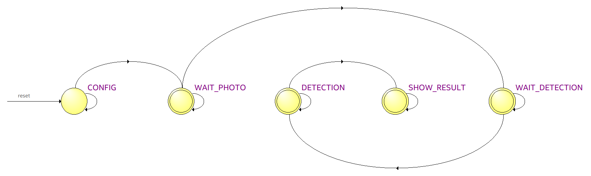

# Handwritten digit detection on FPGA

The goal of this project is to implement Rosenblatt's perceptron algorithm for classification of handwritten digits on FPGA using VHDL. The project was developed on a **Altera DE2-115** board and includes interfaces with a **VGA monitor**, an **LCD** and a **TRDB-DC2** camera.

The perceptron was trained with Python using the MNIST dataset to classify zeros, ones and twos.

Please check the project's [video demo](https://www.youtube.com/watch?v=SyL3lp6TRCY).

## User tutorial

The user has several inputs to interact with the circuit:

- KEY(0): *reset* button
- KEY(1): *take photo* button
- KEY(2): *start classification* button
- SW(11 downto 0): *exposition time* switches
- SW(17 downto 12): *black and white threshold* switches

Initially, the system is at the *CONFIG* state. At this state, we configure registers on the camera via the **I2C** communication protocol (set exposition time, image dimensions, etc). **In order to change exposition time, the user must modify switches 0 to 11 and press the reset button in order to commit his changes to the camera's registers**.

Then, the system automatically transitions to the *WAIT_PHOTO* state. In the VGA monitor, the user can visualise the image currently stocked in memory.

Once the handwritten digit is well positioned on the monitor, the user must press the **KEY(1)** button to move on. From this point on, no further write operations are carried out in the image (in other words, the photo on the screen is now saved in memory).

Then, the system transitions to the *WAIT_DETECTION* state. In this state, the VGA monitor shows the image in *black and white format*. **In order to change the white intensity threshold, the user must modify switches 12 to 17. The digit must be clearly visible on the monitor before continuing.**

**If the user is not satisfied with his photo, he can press the reset button to take a new photo. Or if he is satisfied, he must press the KEY(2) button to start classification**. Once classification starts, the system transitions to the *DETECTION* state, where a full sweep of the image RAM and the perceptron RAM will be performed in order to predict the label of the taken photo.

Once the calculation is complete, the system automatically transitions to the *SHOW_RESULT* state. At this state, the LCD displays the detected digit.

## Perceptron Model

Rosenblatt's perceptron is a classical model for binary classification problems. Using scaled weights and the Heaviside step as the activation function, we could export it to our VHDL project using only integers. The Perceptron model has been trained in Python with Google Colab using over 8000 images from the **MNIST dataset**. A smaller version of the dataset and a Python script are provided in the *Perceptron* folder to run locally.

The heatmap below shows 

For further details, please check the project report.

## VHDL design

The design is organised into **datapath/control unit** entities. The top-level entity diagram below allows visualisation of signals that drive the design's logic and the outputs from the datapath.

