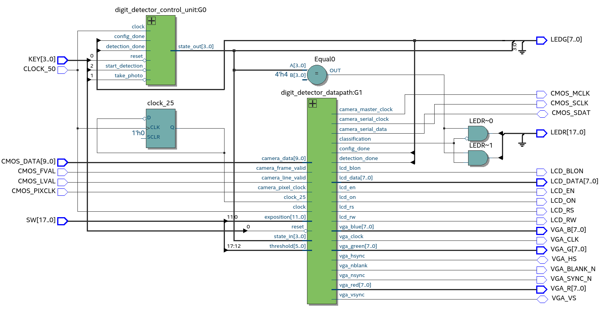

# Handwritten digit detection on FPGA

The goal of this project is to explore and implement a machine learning solution for handwritten digit detection of FPGA using VHDL.

## State Machine

Initially, the system is at the *START* state. To start a run, the user can press the *KEY(1)* button triggering the transition to the *TAKING_PHOTO* state. At this state, we perform of full sweep of the camera frame and write an image to memory. The *TRDB-DC2* camera was used.

Once the full image has been written, we transition to the *CONVERT_TO_RGB* state, where we apply a demosaicing algorithm to convert the image from bayer pattern to RGB. Once the conversion is complete, we transition to the *CONVERT_TO_GRAYSCALE* state, where we convert each pixel in the RGB image to grayscale. The final image is shown on a VGA monitor.

Finally, we transition to the *DETECTION* state where the system predicts which digit best matches the one in the photo.

Once the prediction is done, we wait at the *DONE* state. In order to return to the *START* state, the user must press the *KEY(0)* reset button.

## VHDL design

The design is organised into **datapath/control unit** entities. The top-level entity diagram below allows visualisation of signals that drive the design's logic and the outputs from the datapath.

