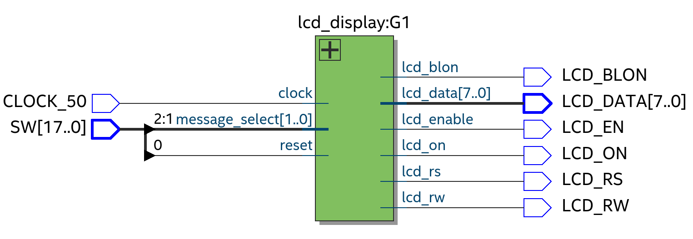

# LCD controller

The goal of this subproject is to develop a controller for the **liquid crystal display**(LCD) embedded on the Cyclone IV FPGA used for the project.

The messages are hardcoded in the component architecture, we use the switches to select the message we want to display on the LCD.

Please check our [video demo available on Youtube](https://youtu.be/utlGScaUETE)!